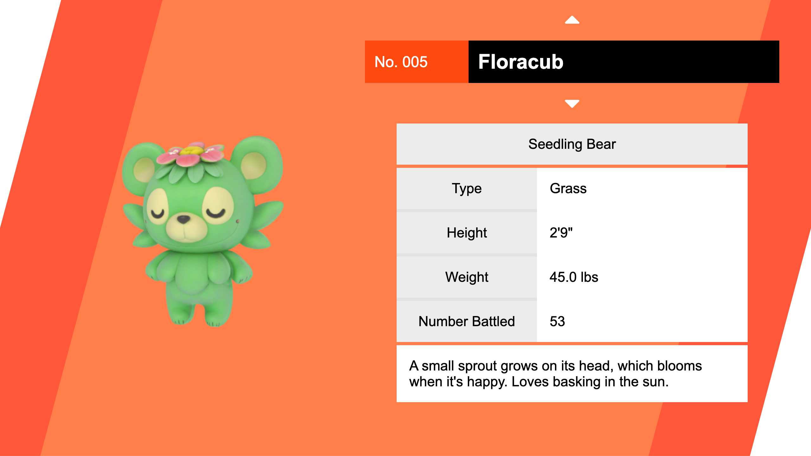

# CreatureDEX



A creature index that is inspired by the Pokédex in Pokémon Sword & Shield. Built with Vue.js and Babylon.

**Live Demo:** [creature-dex.vercel.app](https://creature-dex.vercel.app)

The creatures featured in this project are AI generated and not at all affiliated with any copyrighted property.

**Music by**

[Geoff Harvey - Pixabay](https://pixabay.com/music/cartoons-cute-creatures-150622/)

**Sound Effects**

Mouse click sound effect by [matthewvakaliuk73627-48347364 - Pixabay](https://pixabay.com/sound-effects/mouse-click-290204/)

There are no official assets from Pokémon in this project. Pokémon is owned by Nintendo, Game Freak, and Creatures. No copyright infringement intended.

## Setup

Make sure to install dependencies:

```bash
# npm
npm install

# pnpm
pnpm install

# yarn
yarn install

# bun
bun install
```

## Development Server

Start the development server on `http://localhost:3000`:

```bash
# npm
npm run dev

# pnpm
pnpm dev

# yarn
yarn dev

# bun
bun run dev
```

## Production

Build the application for production:

```bash
# npm
npm run build

# pnpm
pnpm build

# yarn
yarn build

# bun
bun run build
```

Locally preview production build:

```bash
# npm
npm run preview

# pnpm
pnpm preview

# yarn
yarn preview

# bun
bun run preview
```
